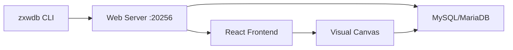

# What is zxwdb?

zxwdb is a modern, visual database designer for MySQL and MariaDB. It provides an intuitive drag-and-drop interface for designing database schemas, managing data, and creating relationships between tables.

## Overview

zxwdb combines the power of professional database design tools with the simplicity of modern web applications. Whether you're a database administrator, developer, or student, zxwdb helps you design and manage your databases visually.

## Key Features

### 🎨 Visual Schema Design
- **Drag-and-Drop Canvas**: Create and arrange tables visually
- **Smart Relationships**: Draw connections between tables to create foreign keys
- **Auto-Detection**: Automatically imports existing schema with all relationships
- **Live Preview**: See your schema in real-time as you design

### 💾 Direct Database Integration
- **Auto-Save**: Changes are saved directly to your MySQL/MariaDB database
- **No Export Needed**: Works like MySQL Workbench - direct manipulation
- **Real-Time Sync**: Schema changes are immediately reflected in the database
- **Safe Operations**: Undo/Redo support for all modifications

### 📊 Data Management
- **Browse Data**: View table contents with pagination
- **CRUD Operations**: Insert, update, and delete records
- **Related Records**: Navigate through foreign key relationships
- **Query Builder**: Run custom SQL queries with templates

### ⚡ Performance
- **Fast Startup**: Built with Vite for instant load times
- **Smooth Animations**: Powered by ReactFlow for 60fps canvas
- **Lightweight**: Minimal resource usage, runs on port 20256
- **Responsive**: Works seamlessly on different screen sizes

## How It Works

1. **Start**: Run `zxwdb` command in terminal
2. **Connect**: Open browser at localhost:20256
3. **Design**: Connect to your database and start designing
4. **Save**: All changes are automatically saved to database

## Why Choose zxwdb?

### vs MySQL Workbench
- ✅ Faster startup and lighter weight
- ✅ Modern, intuitive UI with dark/light themes
- ✅ Better relationship visualization with cardinality badges
- ✅ Built-in data browser with FK navigation
- ✅ Runs in browser (no installation needed)

### vs phpMyAdmin
- ✅ Visual schema designer (not just SQL)
- ✅ Drag-and-drop relationship creation
- ✅ Better for schema design and planning
- ✅ Keyboard shortcuts for power users
- ✅ Undo/Redo support

### vs dbdiagram.io / draw.io
- ✅ Connected to real database (not just diagrams)
- ✅ Auto-save to database
- ✅ Data management included
- ✅ Import existing schemas automatically
- ✅ No need to export SQL manually

## Use Cases

### Development
- Design new database schemas from scratch
- Modify existing schemas with visual tools
- Test relationships and constraints quickly
- Generate DDL for documentation

### Learning
- Understand database relationships visually
- Practice database design principles
- See immediate results of schema changes
- Experiment safely with undo/redo

### Production
- Document existing database schemas
- Plan migrations visually
- Quick data inspection and editing
- Generate schema documentation

## Architecture

zxwdb is built with modern web technologies:

- **Frontend**: React 18 + Vite
- **Canvas**: ReactFlow for visual design
- **State**: Zustand for state management
- **Styling**: Tailwind CSS with custom theme
- **Backend**: Express.js REST API
- **Database**: mysql2 driver for MySQL/MariaDB

## Philosophy

zxwdb follows these principles:

1. **Visual First**: Database design should be visual and intuitive
2. **Direct Manipulation**: Work directly with the database, no export/import
3. **Fast Feedback**: Changes should be immediate and visible
4. **Progressive Enhancement**: Start simple, add complexity as needed
5. **Developer Experience**: Keyboard shortcuts, undo/redo, smooth UX

## Next Steps

Ready to get started?

- [Installation Guide →](/guide/getting-started)
- [Quick Start Tutorial →](/guide/quick-start)
- [Feature Overview →](/features/visual-designer)

## Community & Support

- 📦 [NPM Package](https://www.npmjs.com/package/@fiqihbadrian/zxwdb)
- 💻 [GitHub Repository](https://github.com/fiqihbadrian/zxwdb)
- 🐛 [Report Issues](https://github.com/fiqihbadrian/zxwdb/issues)
- 📧 Email: fiqihbadrian@example.com

## License

zxwdb is [MIT licensed](https://github.com/fiqihbadrian/zxwdb/blob/main/LICENSE).
